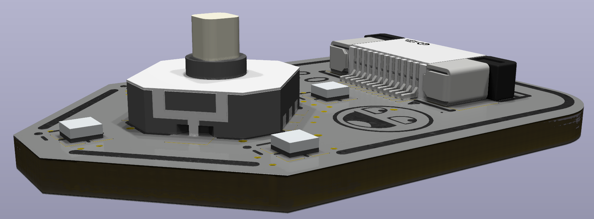
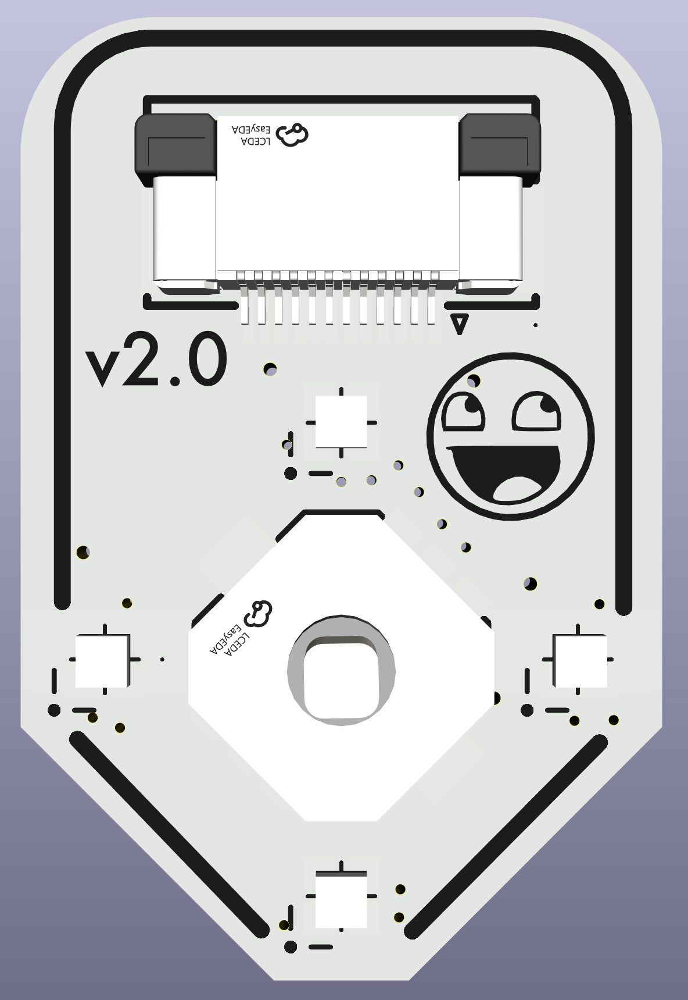
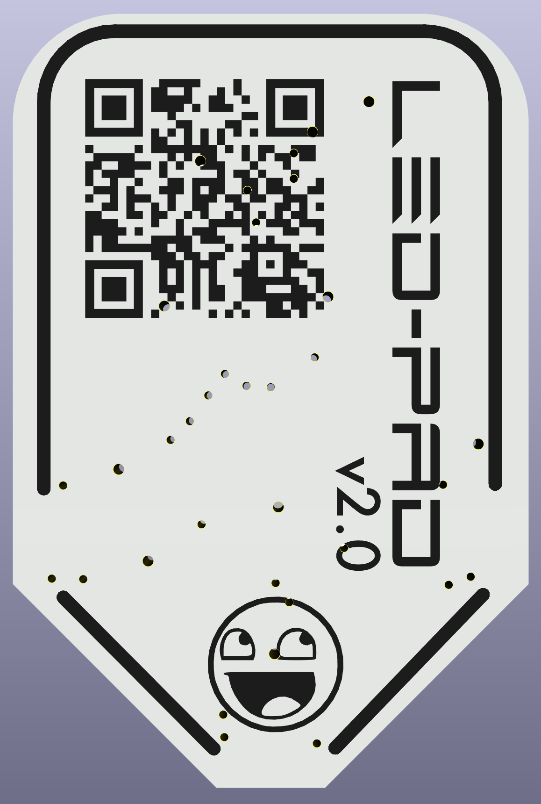
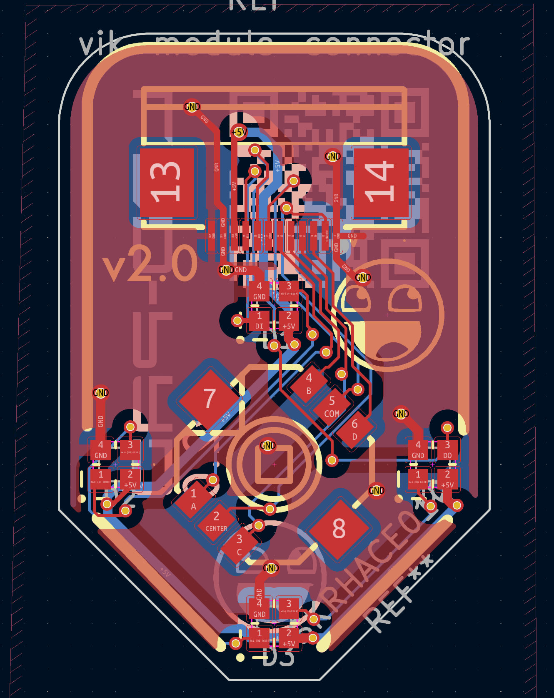
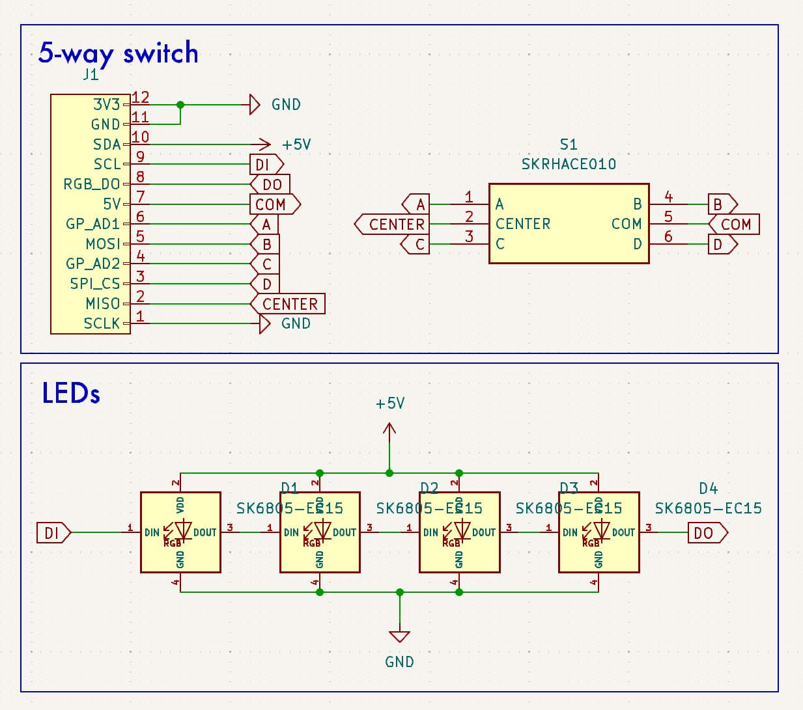

# led-pad

NOTE: v2.0 is currently un-tested, but the order is on the way.

A simple PCB featuring a light-touch five-way switch with four leds, connecting via 12-pin 0.5mm-pitch FFC.
These are used as the dpad on my keyboards.

The SKRHACE010 five-way switch was used on my other pcb, and it's quite nice to use.  The [datasheet](https://www.mouser.ca/datasheet/2/15/SKRH-1370966.pdf) says it's 120gf operating force, but in practice it feels much lighter, especially compared to the Omron B3U-1000P (150gb +/-50gf).

The only challenge is the stem size is very small (1.95mm square).

I added the SK6805-EC15 LEDs at each direction because more visible is more better.

